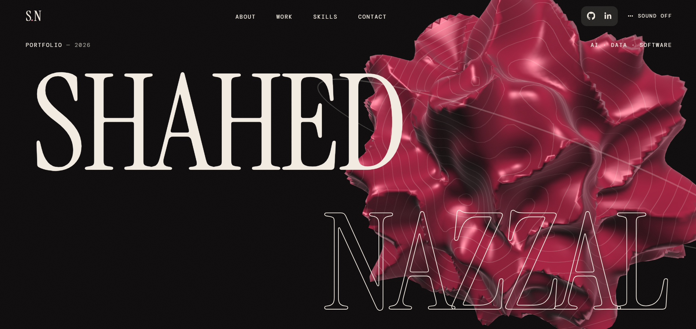

# Shahed Nazzal

### AI & Data Science Graduate · Builder · Curious by Nature

I’m Shahed — a recent Artificial Intelligence & Data Science graduate who enjoys turning ideas into things people can actually use.

This repository contains my personal portfolio — a space where I bring together my work across **AI, data, software, and full-stack development**, while continuing to explore where I want to take my career next.

[**View Portfolio ↗**](https://shahdnazzal.github.io/Portfolio/)

---

## ✦ What I Build

I like working at the intersection of **intelligent systems, data, and software**.

My projects explore things like:

* 🤖 Machine Learning & Computer Vision
* 🧠 Generative AI, LLMs & RAG
* 📊 Data Analysis & Machine Learning
* 🌐 Full-Stack Web Applications
* ⚡ AI-powered applications & APIs
* 🗄️ Databases, backend systems & deployment

---

## Selected Work

### DriveSkills

**AI-Based Driving License Examination System**

A computer-vision-based driving examination platform built as my graduation project. I led the AI model training and evaluation, working with YOLOv8 detection and segmentation across multiple driving-test tasks.

**97.4% peak mAP@50**

### Evolva

**Women’s Fitness & Wellness Platform**

A full-stack platform combining trainers, subscribers, community features, real-time communication, and an AI fitness coach capable of generating structured 7-day plans.

### Knowledge Assistant

**AI-Powered RAG System**

A retrieval-augmented system designed to let employees interact with internal company knowledge through document ingestion, embeddings, vector search, and an LLM-powered question-answering experience.

### Customer Churn Analysis

**Data Analytics & Machine Learning**

An end-to-end analysis of 7,000+ customer records, combining segmentation, churn prediction, machine learning models, and interactive business dashboards.

---

## Tech

**Languages**
Python · JavaScript · TypeScript · SQL

**AI & Data**
Machine Learning · Deep Learning · Computer Vision · YOLOv8 · LLMs · RAG · Embeddings · Vector Search · Pandas

**Development**
React · Next.js · FastAPI · REST APIs · Supabase · PostgreSQL

**Tools & Deployment**
Git · GitHub · Docker · Hugging Face · Vercel · Netlify · Power BI · Tableau

---

## A little more about me

I’m interested in building useful things, understanding how they work under the hood, and continuously expanding the range of problems I can solve.

I don't see my career as being limited to one label.
**AI, data, software, and everything in between are all part of the journey.**

---

### Let’s build something meaningful.

**[Portfolio](https://shahdnazzal.github.io/Portfolio/) · [GitHub](https://github.com/ShahdNazzal) · [LinkedIn](https://www.linkedin.com/in/shahd-nazzal-594049298/)**

